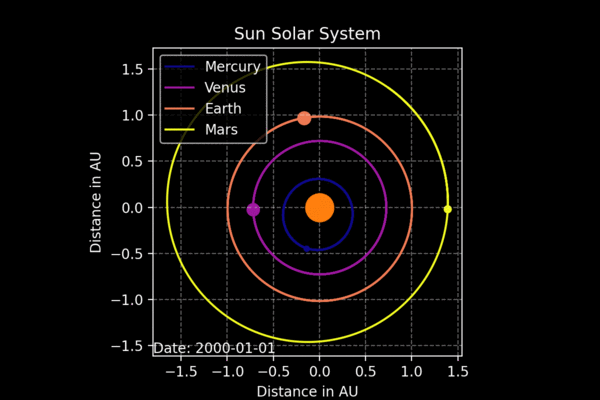

# Solar system simulator

This repo contains a python script to simulate solar systems. The script has only been tested with our own [Solar System](https://en.wikipedia.org/wiki/Solar_System).

 This script was written in the summer of 2020 to improve on a program I had written for [pico-8](https://www.lexaloffle.com/pico-8.php). Because of the pico-8's limited float and integer sizes (and the fact that I had to use [Euler method](https://en.wikipedia.org/wiki/Euler_method) for integration), the orbit calculations were way off. This script is by no means an accurate representation of a planetary system -- it only calculates forces between each satelite and the star -- but at least it seems to be fairly close to other simulations and measurements.

## Requirements

The script requires the following modules:

- datetime
- spiceypy
- scipy
- numpy
- matplotlib

## How the script works

Enter the simulation start and end dates in the start_date_utc variables. The sec_per_iteration variable controls the precision of the calculations and the speed of the animation. The default value of 86 400 is equal to one day (60 sec/min \* 60 min/hour \* 24 hours/day), which means we perform one calculation of the orbits per day and that every frame of the animation represents one day.

Initialize a planetary system by doing something like `Sun = planetary_system(10, "Sun", sun_mass_in_kg)`.

Initialize planets as `Planet` instances by doing something like `earth = Planet(399, "Earth", Sun)`, where Sun is the planetary_system instance you constructed earlier. 399 is the [NASA NAIF ID](https://naif.jpl.nasa.gov/pub/naif/toolkit_docs/FORTRAN/req/naif_ids.html) for the planet.

## How accurate is the simulation?

I have not tested the accuracy of the simulation yet, but the orbits seem to be quite accurate (and Earth takes 1 year to orbit the Sun). *The size of the planets and the Sun is not to scale*. The sizes of the planets are correct relative to each other, but they are magnified relative to the Sun. The size of the planets and the Sun is also magnified relative to the distances between them.

## Theory on satelite orbits

The gravitational force $\vec{F}$ on a satelite with mass $m$ is given by:

$$ {F}_G = - \frac{GMm}{r^2} $$

Where $G$ is the gravitational constant, $M$ is the mass of the central object (the Sun in our case), $m$ is the mass of the satelite and $r^2$ is the square of the distance between the objects.  

We can also express the gravitational force as a vector:

$$ \vec{F}_G = - \frac{GMm}{r^3}\vec{r} $$

where $\vec{r}$ is the position vector and $r= \lvert \vec{r} \rvert$.

From Newtons second law we have $\sum{\vec{F}} = m\vec{a}$ and substituting for $\vec{F}_G$ gives:

$$ m\vec{a} = - \frac{GMm}{r^3}\vec{r} \Leftrightarrow \vec{a} = - \frac{GM}{r^3}\vec{r} $$

We can find the velocity and position of the satelite by integration as the acceleration of the satelite is the derivative of the velocity and the double derivative of the position.

$$  \vec{a} = \vec{\dot v}  = \vec{\ddot r} $$

In this script we find the positions by numerical integration. To accomplish that we construct a vector $\vec{x}(t)$ such that:

$$ \vec{x}(t) = \begin{bmatrix} x(t)\\ y(t) \\ z(t) \\ v_x(t) \\ v_y(t) \\ v_z(t) \end{bmatrix} $$

This state vector contains both the position and velocity of the satelite. We also define the function $f$ such that $\frac{\mathrm{d}\vec{x}}{\mathrm{d}t} = f(\vec{x},t)$ and use numerical integration to find the solution to our differential equation.

$$ f(\vec{x},t) = \begin{bmatrix} v_x(t)\\ v_y(t)\\ v_z(t)\\ F_x/m\\ F_y/m\\ F_z/m \end{bmatrix} $$

The initial values for our initial value problem are sourced from [NASAs SPICE Toolkit](https://naif.jpl.nasa.gov/naif/toolkit.html).

Suggested reading on python simulation of the two-body problem:

- [Scientific computing toolbox's introduction](https://faculty1.coloradocollege.edu/~sburns/toolbox/ODE_II.html) to 
`odeint()` in python
- [C.P. Dullemond of the University of Heidelberg's introduction to the N-body model](http://www.ita.uni-heidelberg.de/~dullemond/lectures/studtage_compastro_2018/Chapter_1.pdf)
- [University of Oslo AST1100 lecture notes on the general solution to the two-body problem](https://www.uio.no/studier/emner/matnat/astro/AST1100/h13/undervisningsmateriale/ast1100-fullstendig.pdf)
